An excellent resource to guide your first steps
using the Optimise MS application for data collection

Optimise MS is a system for recording data including demographics, clinical events, treatments and tests in a fashion interoperable with [Clinical Data Interchange Standards Consortium (CDISC)](https://www.cdisc.org/) standards for Multiple Sclerosis. Optimise MS allows researchers to better monitor MS patients’ progress, record outcomes and evaluate treatments.

Users can enter demographic, medical history, clinical event, visit, test and treatment data.

Optimise MS can be used in various settings and you can choose to install it in offline mode as a desktop application, useful when a network connection is not available enabled or in online mode, installed on your IT department servers usable by a whole team simultaneously.

This guide assumes that the Optimise MS system has been successfully configured as described at [Getting started](https://optimise.dsi.ic.ac.uk/#getting-started). An administrator needs to be defined who can control permissions for data access and securely provide users with login details. The PC and login passwords should be kept securely.

Patient identifiers 
===================

A patient identifier is required when creating a new patient in Optimise MS. The term Patient ID, used in this guide, refers to this identifier which may correspond to the patient's NHS ID, CHI ID or otherwise qualified hospital identifier. Optimise MS stores an independently generated pseudo-anonymised ID along with the patient ID entered by the user at patient creation time - this generated identifier is referred to as Optimise ID.

The Optimise ID is included in the exported data (more about the export in the section [Exporting patient data](#export)). Note that you can retrieve the original patient ID using the [Search tool](search) by searching the corresponding Optimise ID; you must be an administrator on the system to carry out this de-anonymisation operation.

Logging in 
==========

<blockquote>

#### For users of the online version

To start using Optimise MS, first open your favourite modern [Browser](https://optimise.dsi.ic.ac.uk/#support). Then, enter the hosting address in the address bar _(You may need the assistance of your IT administrator)_.

</blockquote>

<blockquote>

#### For users of the desktop version, working offline

To begin, simply launch the Optimise MS program installed on your computer. It might be found on the desktop _(You may need the assistance of your IT administrator)_ and features the following icon:

</blockquote>

 

Once done, you should see the the following screen.

Enter the user name and password (in the boxes as shown below) that were given to you and click the Login button. The default username is _admin_ and the default password is _admin_.

If the log-in is unsuccessful, you will get a message as shown below. Re-enter user credentials and click Login.

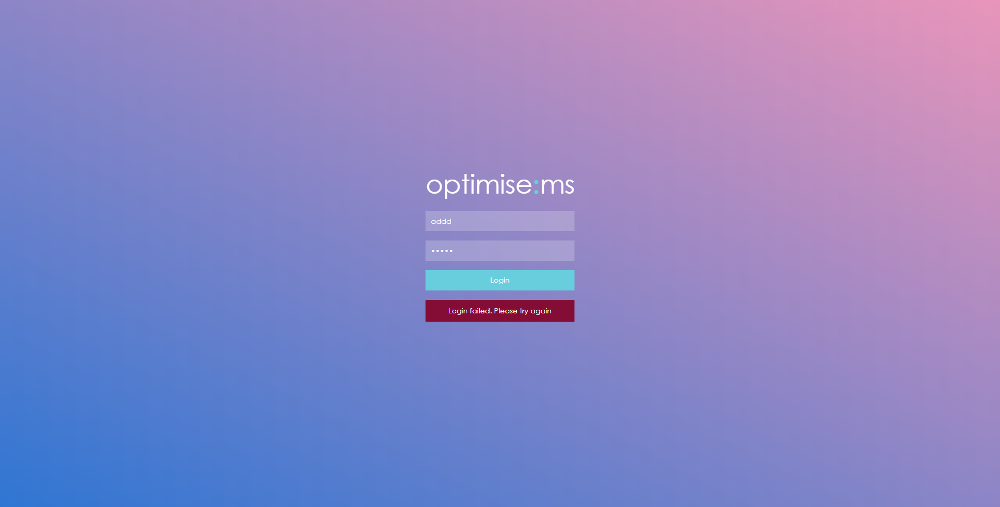

If the log-in is successful, you should see the following screen.

Searching patients
==================

You can search the database using the user-friendly search tool available after successful log-in.

To search by patient ID, select Patient ID from the drop-down list labelled as 'Search by:'.

Click on the box labelled 'Containing'- this is below the 'Search by' list- and enter the patient ID you want to search for.

As you type in search value box ('Containing' box), the patients with ID that contain the text you entered will be shown in the area below the search box. Basic patient information for each listed ID is also shown. If no patients are listed, then there are no patients with that ID already in the database. You can begin to enter data for a new patient, by entering the ID- please see the section [Creating a new patient](#createPatient).

Data files generated by Optimise MS using the [Export option](#export) do not include the [patient ID](#patientID). Should you wish to retrieve the Patient ID, you can do so using the Search tool. You will need to obtain the Optimise ID (labelled 'USUBJID' in the CDISC standard) and search by 'Optimise ID' in the drop-down list.

Search by fields other than Patient ID and Optimise ID (generated Optimise ID) is also available. The example below refers to a search by country of origin with search value 'Canada'. The search results include two patients; patients with IDs Optimise1 and Optimise2.

Choose from the list of patient IDs below the search box by clicking on the patient box. To view and/or enter data for patient with ID Optimise1, for example, click on the respective box (highlighted).

The timeline and a summary of the patient's Medical History will be available in the left panel. An overview that includes the patient profile, the primary MS diagnosis and other sections is available in the right panel (see next screenshot). You may add, edit, or delete data for these sections as described in [Entering patient data](#enterPatientData).

To exit the patient's (here, Optimise1) records and return to the Patient Search page where you can search and create patients, click on  which is located near the top center of the page as shown below.

Creating a new patient
======================

There are two ways to create a new patient in Optimise MS; by clicking directly on the button 'Add a new patient' at the top of the page or by using the search tool.

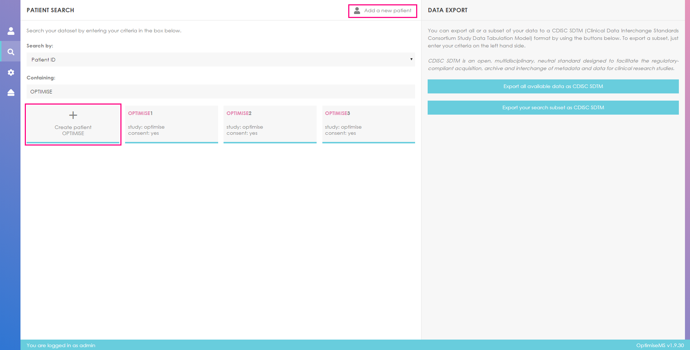

To create a new patient using the first way, click on Add a new patient. Enter the patient ID in the Patient ID input box in the new patient profile form in the right panel. The form includes the patient consent status. You need to set the consent status for patient data sharing to Yes or No at this stage.

Complete the form (the option Unknown may be selected where appropriate), scroll down to the end of the form and click Submit to create the patient. To cancel the patient creation, click on  at the top right corner of the screen.

A warning message will be shown if any of the fields are empty or unselected when you click Submit. All the fields in this form are required in order to add the patient to the system. If you see the following message, please ensure the new patient profile form is completed before clicking Submit. Please note that some field propose explicitly the value 'Unknown', it is an acceptable value as long as it is selected from the list.

If the patient creation is successful, you should see the following page. Please note that a few fields are conditional on the patient profile (Pregnancy, for example, is conditional on sex) and may be unavailable to some patients.

At any point you can return to the patient search page by clicking on  in the left panel (see below).

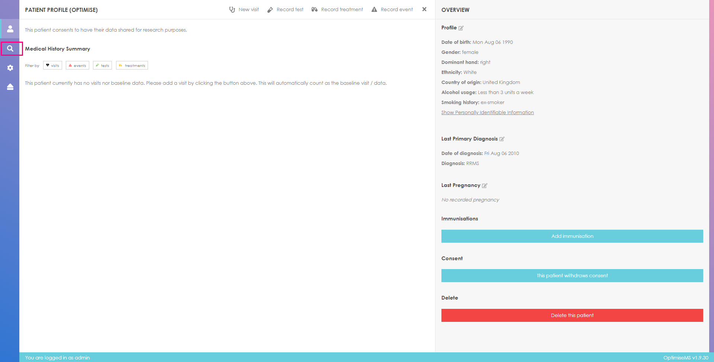

You may also return to the patient search page by clicking on  near the top center of the screen highlighted below.

To create a new patient using the search tool, select Patient ID as the search field list and enter the patient ID in the search value box. If there are no patients with the entered ID (here, 'opt'), you may create a new patient by clicking the button

Once you click the Create button, you should fill the new patient profile form in the right panel as described above. The patient ID is shown at the top of the new patient profile form- this is automatically filled.

Updating patient consent
========================

Optimise MS is intended to be used after consent is given by patients to hold their data outside of a hospital or clinic IT system. The clinical user of Optimise MS must indicate that appropriate consent has been given.

You may update the patient consent status at any time. Go to the main patient profile page and use the highlighted control in the right panel to update the status of patient consent.

If the current consent status is set to Yes, the text on the consent button will read as follows:

For patient profiles currently not consenting, the consent button will look like

The current patient consent status is always visible on screen. Clicking the consent button in the right panel updates this label accordingly.

Deleting a patient
==================

Administrator users may need to remove a patient from the database (i.e. Right to be forgotten). To delete a patient click on 'Delete this patient' in the right panel. Please note this is only available to administrator users.

Click on YES, I AM SURE! to confirm the deletion or click  at top right corner of the pop-up message box to cancel.

Entering patient data
=====================

Patient overview
----------------

The Profile section in the Overview panel contains the profile data entered during patient creation. To edit the Profile section, click the button  next to Profile. Click on  to view the Patient Identifiable Information.

Edit the Patient Demographics form as necessary and click Submit to save the changes or  to return to the Overview panel.

The Primary MS Diagnosis section in the Overview panel contains the most recent diagnosis data. To edit this or add more diagnoses, click  next to Primary MS Diagnosis.

A list of all prior MS diagnoses is shown in the right panel. Click on  to delete the diagnosis entry. Click on  to edit that entry.

The form in the right panel below becomes available if you click . Complete the form as necessary and click Confirm change to save or Cancel or  to return to the Overview panel.

To add more primary MS diagnoses, click on

Enter the diagnosis date and select the diagnosis term. Click Submit to add the entry or Cancel to return to the diagnosis panel. Click  to return to the Patient Overview.

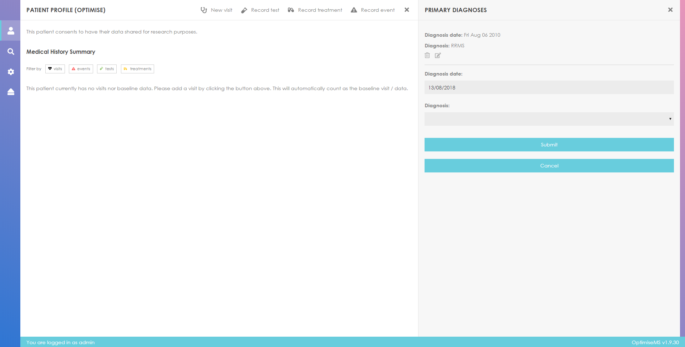

To add or edit Pregnancy data, click on . The most recent Pregnancy record (by pregnancy date) is listed in the Overview Panel.

Click on

in the right panel to record a pregnancy or click on  or  to edit or delete existing entries, respectively.

Fill in the form. Untick  to enter outcome date, outcome term and MedDRA code. Click Submit to record the pregnancy or Cancel to return to the list of Pregnancies. Click  to return to the Patient Overview.

To enter Immunisation data, click on

Enter data in the highlighted form shown below. Click Submit to add the new immunisation or Cancel.

The immunisation records are added to the Overview panel as shown below. To remove an Immunisation entry, click  next to that particular entry.

Medical history
---------------

The filtering tool in the Medical History Summary allows you to select which medical elements are included in this section. This is especially useful for patients with considerable amount of recorded data. To include Treatments and Tests only, click on the respective buttons.

### Visit data

Each clinical consultation is represented as a Visit in Optimise MS. A “Baseline Visit” would usually refer to the first visit at the clinical site or consultant responsible for the database.

Click on  to create a new visit for the patient.

Complete the new visit form in the right panel. Select the reason of the visit from the list of available options- this includes Routine, Drug Monitoring, Relapse Assessment and Urgent. Click Submit to create a visit.

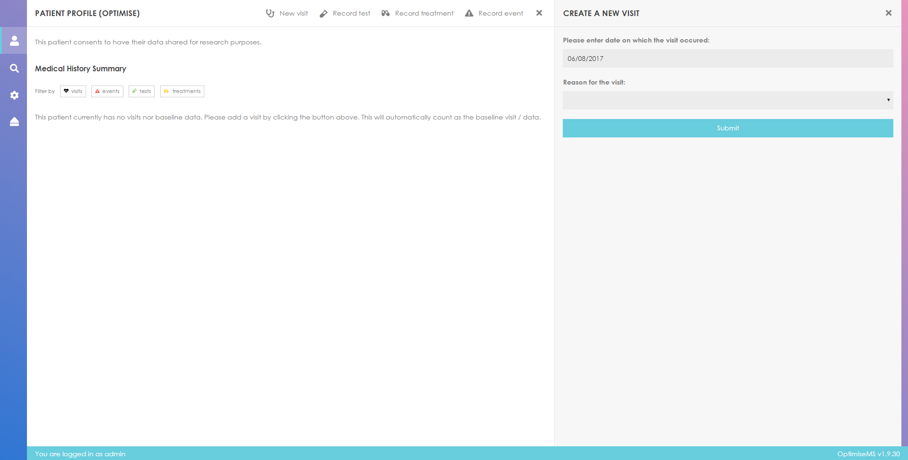

A warning message is shown if the form is incomplete when Submit is clicked.

If the visit is successfully created, it will be added to the Medical History Summary and to the Timeline. Baseline visits are labelled as such.

The reason for the visit entered when the visit is created is used to label the visit entry in the Medical History Summary. A relapse assessment visit is shown below.

Enter Anthropometry and Vital Signs data, if available, by clicking on the highlighed button in the Medical History Summary. Fill in the right panel form. Click Save and then click on  at the top right corner to return to the Patient Overview. To cancel the data entry and return to the Overview without saving, click on .

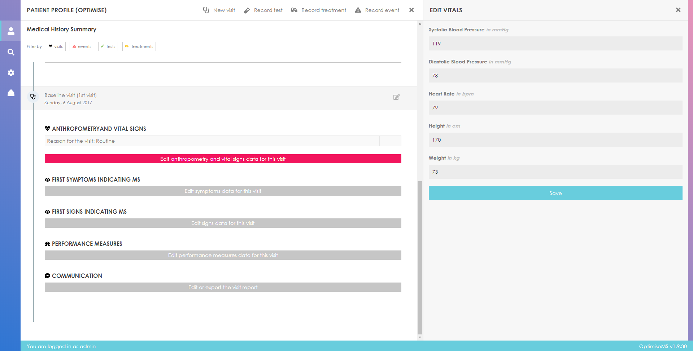

The data will be added to the Medical History Summary in the appropriate section (Anthropometry and Vital Signs, here).

Symptoms and Signs are recorded only at a high level in the Optimise MS database in an attempt to maximise the efficiency of their recording in the clinic and thus encourage their completeness. Symptoms reported by the patient and Signs observed by the neurologist are recorded separately.

Click on 'Edit symptoms data for this visit' or 'Edit signs data for this visit' buttons to enter Symptoms or Signs, respectively, elicited at the visit. For baseline visits, these will be labelled as 'First symptoms/signs indicating MS'. For non-baseline clinical visits, they will be labelled simply as Symptoms/Signs.

Enter any present symptoms by clicking on the buttons or selecting a value from the drop-down lists in the right panel form. For example, the neurologist might have observed fatigue for the patient. Scroll down to the end of the form and click Save. To exit the form and return to the Patient Overview, click  at the top right corner. The form can be edited at a later time.

The recorded symptoms are added to the Medical History Summary.

Similarly, enter any signs by filling and saving the Signs form in the right panel. As an example, the patient might have shown evidence for cognitive dysfunction with impairment of memory and had reduced sensitivity to the colour red with the left eye.

Any recorded signs are added to the relevant section in the Medical History Summary after Save is clicked.

You will have the options of entering any comorbid affect by clicking on 'Edit comorbidities'. The comorbitity records management panel will appear in the right panel. Optimise MS uses ICD11 for the classification.

When looking to reference an comorbitity a drop-down list of International Classification of Diseases codings defined by the World Health Organization (ICD11, see [https://icd.who.int](https://icd.who.int)) is available.

By clicking on the field, a browsing tree will appear. It will display the \`code\` and \`name\` of the diseases. Click on the arrows  next to each grouping term in the list to follow the expanding tree of terms and identify the specific disease coding of interest. Click on the term to select it. Any term at any level may be added as ICD11.

Click on 'Edit performance measures data for this visit' to enter Performance Measures data.

The EDSS can be entered in two ways; the neurologist’s estimated EDSS or the calculated EDSS. The neurologist’s estimated EDSS score can be entered in the highlighted box in the right panel form.

Only valid EDSS total scores (0 to 10 by 0.5 increment excluding 0.5) may be accepted in this field. Entering an invalid total EDSS, for example 100, will generate an error. Please use the dot notation for the decimal point, i.e. 4.5 is accepted while 4,5 is not.

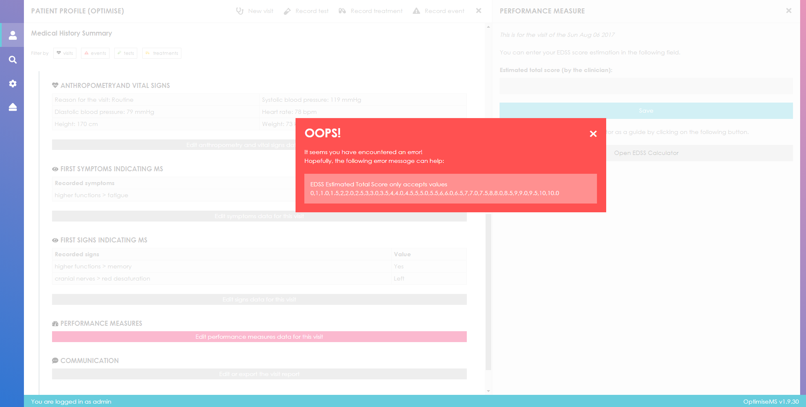

Click Save for this estimated EDSS to be recorded. In addition, or alternatively, the functional systems can be scored separately and the total EDSS can be calculated by clicking on Open EDSS Calculator. The estimated total EDSS entered as described above is carried over to this calculator only if the score is saved (by clicking the Save button).

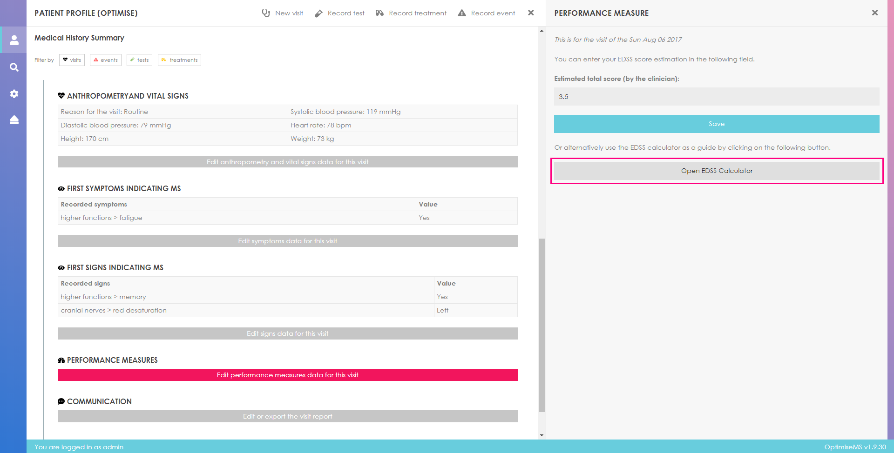

Select a score for each EDSS subcategory. Hover over a score button to see the respective score description highlighted on the right. The calculated total score will be shown in the score box labelled Computed total score (automatically generated). Note that an Ambulation score is required for the functional scores to be saved. The saved estimated total is carried over to the score box labelled Estimated total score (by the clinician). You may update the estimated total here as well.

Click Save to record the scores and then  to exit the calculator. To exit Performance Measures and return to the Patient Overview, click on  at the top right corner of the EDSS form.

The EDSS Total and EDSS Subscores will be listed under Performance Measures in the Medical History Summary. The text of the total scores (estimated and computed) is bold and pink.

Optimise MS supports the generation of a free-text visit report, called a Communication. This can be exported as a .txt file. You may also copy and paste the entered text directly in a document such as a clinic letter generated by other software.

Click on 'Edit or export the visit report' to edit or export a Communication for the visit.

Specific field data entered for the patient from a visit can be added automatically to the Communication by selecting the appropriate buttons above the text area.

Click on the buttons to add the respective recorded data to the report. You may format the text using the available formatting tools. The report can be updated at a later time to include data entered after its creation.

For Clinical Events, Tests and Treatments, the time period to cover can be specified using the drop-down list. The default behaviour is to include observations/records of the last month. Select a different option from the list and click Add to update the report accordingly. Click the Save or Export button or  to return to the Patient Overview.

Treatment and clinical event information covering the entire patient medical history were added to the Communication below using the appropriate buttons and selecting the entire patient history in the time period drop-down list.

Click on  next to the visit entry to update the visit properties.

To edit the visit date or the reason for the visit, click on

and to remove a visit click on

### Test data

Click on  to create a record for a new test for the patient.

Select the date of the test, the type of test (Lumbar Puncture is selected below) and click Submit to create the new test. Click  to cancel and return to the Patient Overview.

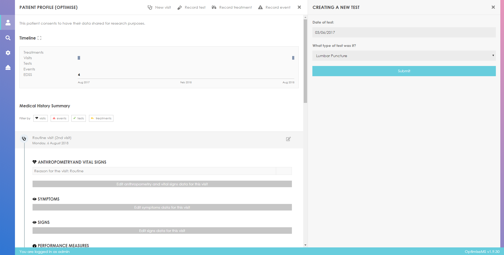

If the test is successfully created, it will be added to the Medical History Summary in the main panel as shown below. The test is also shown on the Timeline (green symbol) above the Medical History Summary.

Click on Results to enter further data for the test.

Complete the form in the right panel and click Save to record the test results.

Entering non-numeric input where this is invalid generates the following error message. Correct and click Save.

At any point you can click  to cancel the test data entry and return to the Patient Overview.

Laboratory tests refer to blood or CSF tests only, e.g. total WBC, bilirubin and specific anti-body titres. After entering test results for a given reporting date, scroll down to the end of the page and click Save. Click  to return to the Patient Overview.

Entering non-numeric characters in the laboratory tests will generate the following error message as numeric input is expected.

Currently, only data concerning the presence or absence of T1 Hypointense Lesions, number of T2 Hyperintense Lesions and gadolinium (Gd) contrast enhancing lesions and brain atrophy scan result can be entered into the Optimise MS database. Some of the available fields for an MRI test type are shown below.

The data input in the MRI form is also validated. Entering non-numeric characters in Number of enlarging lesions, for example, will generate the following error message.

The Evoked Potential test section allows recording of the P100 Visual Evoked Potential amplitude and latency. Sensory Evoked Potentials (SEP) with stimulation in the limbs are recorded if Abnormal. Data validation is applied here as well- only numeric input is accepted in some fields.

### Treatment data

Click on  to enter treatment data.

Fill in the treatment form in the right panel. Click Submit to record the treatment or  to cancel and return to the Patient Overview. A warning message will be shown if required fields are not filled.

Unticking the box  allows you to record a treatment discontinuation by entering the treatment end date.

Any new treatment recorded is added to the Medical History Summary and the Timeline (yellow symbol) as shown below.

To record any interruptions to a treatment, click on Interruptions and then Add interruptions in the right panel.

Enter the interruption start date, uncheck 'The interruption is ongoing' to enter the interruption end date, if known, and record the Reason for the Interruption from the drop-down menu.

If the interruption is related to an adverse event, the next section for Adverse Events should be clicked open. A drop-down list of adverse events defined by the Medical Dictional for Regulatory Activities (MedDRA, see [https://www.meddra.org](https://www.meddra.org)) is available.
Note, however, that MedDRA codings are subject to license. If you have a license ans which to use it, please go to the [Manage MedDRA codings](#meddra) section of this manual which will guide you through the upload process.

By clicking on the field, a browsing tree will appear. It will display the \`code\` and \`name\` of the adverse events. Click on the arrows  next to each grouping term in the list to follow the expanding tree of terms and identify the specific adverse event of interest. Click on the term to select it. Any term at any level may be added as MedDRA.

Complete the form and click on Submit to add the interruption details. Click the Cancel button or on  to exit the interruptions section and return to the Patient Overview.

### Clinical event data

Clinical Events allow entry of data concerning relapses and other clinically relevant changes or adverse events including infections, opportunistic infections, death and other SAE likely related to treatment or malignancies.

Click on  to record a new clinical event.

Fill in the form in the right panel and click Submit to add the event or  to exit without saving and return to the Patient Overview.

The event will be added to the Medical History Summary and to the Timeline (red symbol). You may add Symptoms and/or Signs associated with the Clinical Event using the relevant buttons in the clinical event entry in Medical History Summary, a process similar to the one for Visits described above.

To further describe the clinical event click on Data.

Select the functional systems affected by clicking on the buttons, fill in the rest of the form as necessary, click Save and then  to exit. Click  before clicking Save to cancel the data entry.

The data fields for Infections and Opportunistic Infections are shown below- see right panel forms.

### Editing medical history

Test, medication and clinical event data can be edited at any time by clicking the highlighted buttons in the Medical History Summary and following the steps described above. Additionally, for Clinical Events, Symptoms and Signs can be edited.

To edit data about concerning tests, treatments and clinical events such as dates or type or to delete these entries, click on  as shown below. Click on one of the buttons in the right panel to edit or delete the entry. The informative labels in the right panel will indicate which actions and modifications are allowed.

Using the Timeline
==================

You may click on the coloured shapes or EDSS on the Timeline to access (view/edit) the corresponding entry in Medical History Summary. The computed total EDSS is plotted at the bottom part of the timeline. If the computed total EDSS is not available (i.e. the calculator was not used or the user chose not to save the calculated score), then the estimated EDSS is plotted.

Click on  next to Timeline to maximise the timeline. The horizontal end point (right) of the timeline is the current date. The timeline covers the last month by default. Therefore, any data recorded during this period is shown. You may change this behaviour by reading the guide below the graph.

Follow the instructions below the timeline to interact with it. Zooming in and zooming out as well as navigation to a specific time period are available. The timeline shows Treatments, Visits, Tests, Clinical Events (Relapses and Adverse Events) and EDSS using different colouring.

Zooming out allows the depiction of a larger part of the patient's Medical History. For example, the patient's medical history for the year 2017 is shown below.

Further zooming-out gives a graphical overview of the complete medical history.

The treatment bands (yellow colour) are overlaid with the treatment names and types.

Treatment interruptions are clearly marked with vertical lines that cover the interruption period (from the interruption start date to the interruption end date).

Relapses can be characterised as mild, moderate or severe. The size of the circle depicts this information with larger circles representing more severe relapses. Where this information is not available, relapses are shown as .

A severe relapse that started on the 7th of August 2011 and ended on the same date is shown below. The circle size represents the severity level and the dashed line indicates the duration of the event.

An opportunistic infection (Adverse Event) that lasted one month is shown below.

A line chart is used for the the recorded EDSS with the scores being represented as black labelled points (dots) on the graph.

An EDSS of 2.5 recorded in 2010, an EDSS of 4 recorded in 2013 and an EDSS of 4 recorded in 2015 are shown below. The scores are connected.

Click  at the top right corner to exit the Timeline window and return to the Patient Overview.

Exporting patient data
======================

Optimise MS currently supports the export of patient data in JSON and CSV files. This is available in the right panel on the Patient Search page.

In order to export the database as JSON and CSV files, click on the export button (highlighted) and choose where to save the ZIP folder which you can then extract. You may want to change the name of this folder- the default is attachment.zip. Please note that any Patient Identifiable Information is excluded from the generated JSON and CSV files by default.

The patient ID is not included in any of the export output files; the Optimise ID (an pseudo-anonymised generated ID) replaces the patient ID as described in the section [Patient identifiers](#patientID). The column USUBJID (Unique Subject Identifier) in the exported treatment data CSV file stores Optimise ID.

You can find the respective patient ID using the search tool as described in the section [Searching patients](#search).

The option to export part of the database becomes available if you start using the search tool.

Click on

in the right panel to export the data stored for the patients listed in the search results area below the search tool.

You may export data based on a search by fields such as ID and treatment. Here, for example, only the data for patients diagnosed with RRMS can be exported by clicking the appropriate Export button in the right panel.

Admin menu
==========

Each installation of Optimise MS should have an identified administrator who manages Optimise MS. The administrator can create and delete user accounts, view the action log, where all user actions are recorded, and read messages about the software (e.g. the Optimise MS software version) by accessing the Admin Menu.

The administrator can click on the button located in the left panel as shown below to access the Admin Menu. Note that this is only available to users with administrator rights.

### User management

The administrator can manage the users (create and delete user accounts) by accessing the relevant option (Manage users) in Admin menu. In order to update or delete a user account, click on the respective entry in the list of registered user accounts in the middle panel.

You may create a new user account by clicking on the Create a new user button.

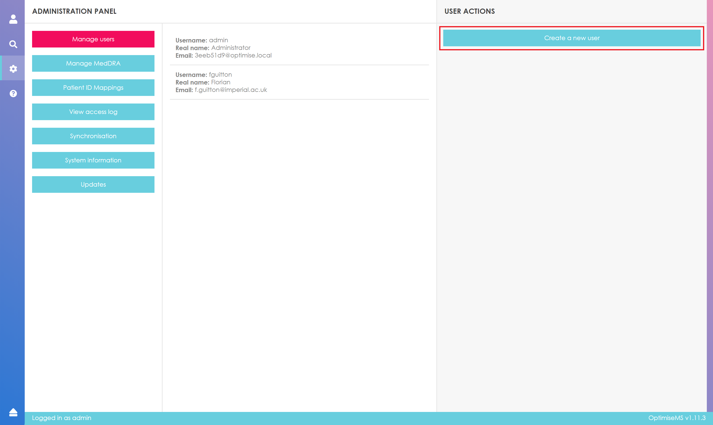

Fill in the highlighted form and click Submit.

The following error message is shown if the submitted form is incomplete. Please complete all fields and re-submit.

To update the password or email for a particular user, select the user from the list (hover over and click on the user entry in the middle panel), fill in the User Information form as shown below and click Submit. Click Cancel to cancel the update.

To withdraw admin rights for admin users, click on the tool shown below.

To delete a user, select from the users list and click on Delete.

A warning message will appear. Click  to cancel the deletion or YES, I AM SURE! to confirm the deletion.

### MedDRA Management

The admin menu has a section allowing the management of MedDRA codings for users posessing a license.
See the [dedicated section](#meddra) of this manual pertaining to MedDRA codings management.

### Patient ID Mappings

While it is not recommended to do so and should be avoided at all times. The software offers the possibility to bulk export the patient ID to optimise ID mappings. You should never do this !

### Synchronisation

For sites that wish to utilise data synchronisation to upload data to a central repository the configuration can be done in the Sunchronisation section.
The "Remote Host" and "Validation Key" are information you should seek from your system administrator.

Once configured, synchronisation should be automatic in most cases. You will see a status indicator in the application's status bar.

If the status bar indicator mentions the remote site is unavailable you may want to contact your administrator for further investigation.

The synchronisation configuration page also features a button that can use to trigger synchronisation manually should this be necessary.

### Updates

The admin menu has a section which allows to monitor for available updates and install them.
See the [dedicated section](#update) of this manual pertaining to updating the software.

### Action Log

### System Information

Information about the software is also available in the Admin Menu.

Managing MedDRA Codings (admin only)
====================================

The initial installation does not come with MedDra coding, due to license reason. The software comes with an opt-in upload of the MedDRA codes, after which users can select desired code in clinical events. NB upload can only be done by admin.

In the Admin Menu, select "Manage MedDRA codings"; you will then see the following panel.

Depending on your subscription to MedDRA and your preference of the granularity of the codings that will be in the application, select the appropriate option. Mdhier.asc contains all the terms higher than "Low-level terms" and llt.asc contains all the "Low-level terms" (in MedDRA terminology).

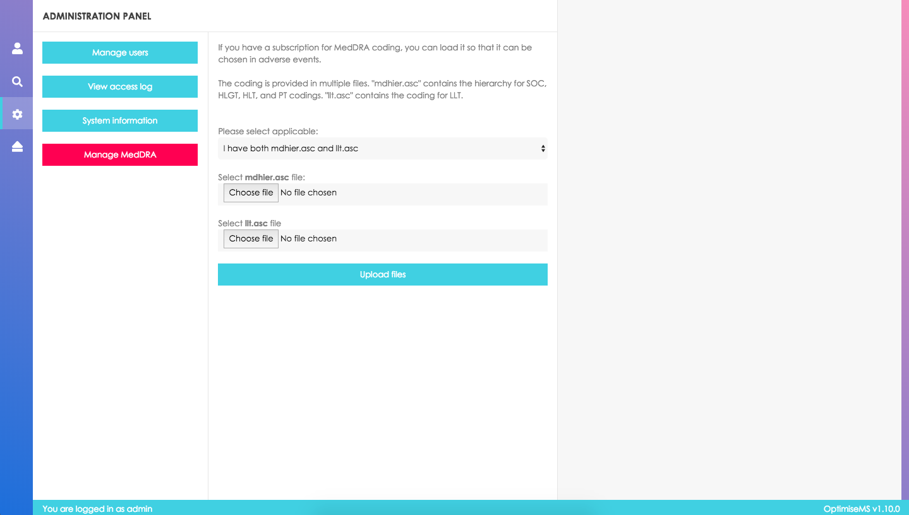

Select the appropriate files of the indicated name in the files provided by MedDRA and click submit. The application will start to process the file. When you see the following message, the upload is finished:

When you get a new version of MedDRA, you can update the codings in the application by doing the same steps. If some patients already have MedDRA coding data associated with them, it will be indicated that it is an old coding. If you decide to edit the MedDRA for a patient, you will only be able to select from the new codings:

Updating the software (desktop only)
====================================

<blockquote>

#### For users of the online version

As this is only available for Desktop installations of Optimise MS, this section is not applicable.

</blockquote>

Optimise MS Desktop application is provided with a built-in update mechanism. To check if an update is available and to perform the installation you must log in as an administrator and visit the "Updates" section.

There you will be able to consult the update status and will be prompted to install if applicable.

The upgrade process will be performed with little friction and you will be able to monitor the progress on the screen.

At the end of the installation you may be prompted to click the "Finish" button with an option to restart Optimise MS immediatly.

Logging out
===========

To log out click on the logout button.

It is located in the bottom left corner of the screen.

